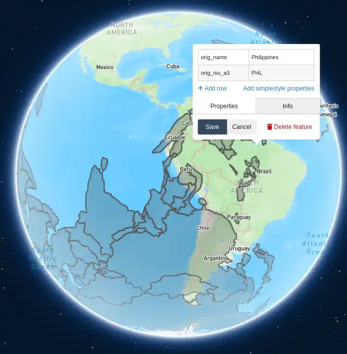

# Antipodal countries

David McCandless shared a [post](https://www.linkedin.com/posts/david-mccandless-4641b54_which-country-is-across-the-ocean-activity-7317621545374265344-V303): "Which country is across the ocean?"


This was cool! It shows which country you would reach if you traveled east or west across the ocean in a straight line.

I was curious which country you would reach if you tunneled below in a straight line. This is called the [antipode](https://en.wikipedia.org/wiki/Antipodes) and there are several visualizations of it.


I wanted an interactive one. Since LLMs are _so_ good, and O3 was just released, [I asked O3](https://chatgpt.com/share/6803528e-3a04-800c-a8df-8693aa1714d5):

> Write a program that shows each country projected to the opposite side of the globe, but only the parts that overlap the ocean.
>
> Figure out where to get the geospatial data for countries online and get it yourself
>
> I don't need you to visualize it. I need the output in an open format that can be visualized in popular open-source or online geo-tools where I can rotate the globe, click on the countries' opposites and see which country is where.
>
> At the end allow me to download the file and tell me where I can view it.

The attempt was not bad at all, but there was a problem:


So, I started again, using ChatGPT's own prompt suggestion, and adding my description of the error. [Here's the chat](https://chatgpt.com/share/68034776-8cec-800c-a85b-7d6bc94411c0):

> Build a _single_ GeoJSON (EPSG:4326) that shows, for each country, only the parts of its antipode that lie over ocean.
> Carefully handle countries that straddle the prime meridian - UK, France, Algeria, etc.

The result is this [`antipodes.py`](antipodes.py) and [`antipodal_ocean.geojson`](antipodal_ocean.geojson) that it generates.
Click the link below to [view it on geojson.io](https://geojson.io/#data=data:text/x-url,https%3A%2F%2Fraw.githubusercontent.com%2Fsanand0%2Fantipodes%2Frefs%2Fheads%2Fmain%2Fantipodal_ocean.geojson)

[](https://geojson.io/#data=data:text/x-url,https%3A%2F%2Fraw.githubusercontent.com%2Fsanand0%2Fantipodes%2Frefs%2Fheads%2Fmain%2Fantipodal_ocean.geojson)

I didn't change O3's script except to add the `uv` dependencies and switch from the 1:10m to 1:110m maps for speed.
To run the script:

```bash
wget https://naciscdn.org/naturalearth/110m/cultural/ne_110m_admin_0_countries.zip
unzip ne_110m_admin_0_countries.zip -d ne_110m_admin_0_countries
uv run antipodes.py
```
